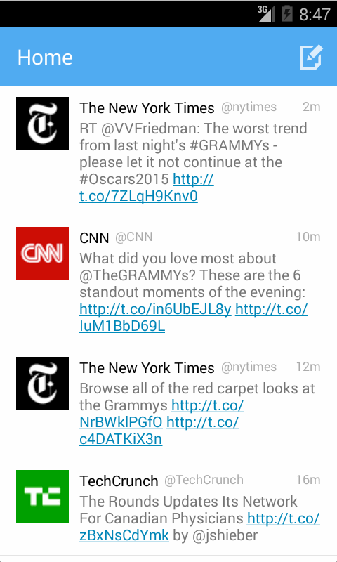

# Simple Twitter Client

This is a simple Twitter client that supports viewing a user's timeline, composing a tweet, and replying to tweets.

Time spent: 11 hours spent in total

Completed required user stories:

* [x] User can sign in to Twitter using OAuth login
* [x] User can view the tweets from their home timeline
* [x] User should be displayed the username, name, and body for each tweet
* [x] User should be displayed the relative timestamp for each tweet "8m", "7h"
* [x] User can view more tweets as they scroll with infinite pagination
* [x] User can compose a new tweet
* [x] User can click a “Compose” icon in the Action Bar on the top right
* [x] User can then enter a new tweet and post this to twitter
* [x] User is taken back to home timeline with new tweet visible in timeline

Completed optional user stories:

* [x] Links in tweets are clickable and will launch the web browser (see autolink)
* [x] User can see a counter with total number of characters left for tweet
* [x] Advanced: User can refresh tweets timeline by pulling down to refresh (i.e pull-to-refresh)
* [x] Advanced: User can open the twitter app offline and see last loaded tweets
* [x] Tweets are persisted into sqlite and can be displayed from the local DB
* [x] Advanced: User can tap a tweet to display a "detailed" view of that tweet
* [x] Advanced: User can select "reply" from detail view to respond to a tweet
* [x] Advanced: Improve the user interface and theme the app to feel "twitter branded"

Walkthrough of all user stories:

GIF created with [LiceCap](http://www.cockos.com/licecap/).