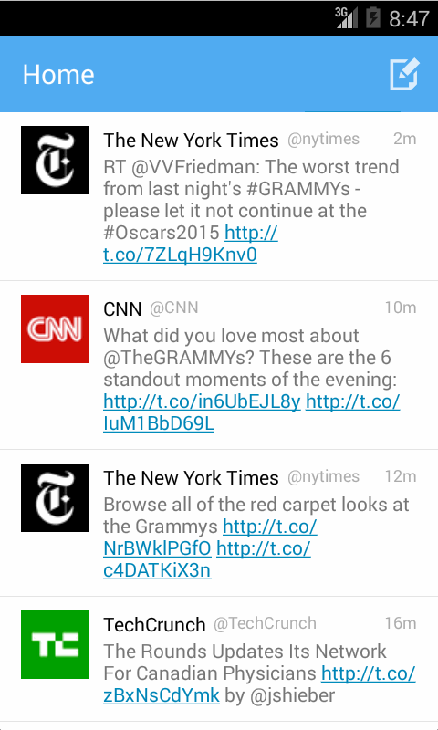

# Twitter Android Application Redux

This is an enhanced version of the Android Twitter Client made previously. In addition to the Home timeline view, a Mentions view has been added that shows the Mentions for the logged in user.  A sliding tab view pager is used to switch between the logged in user's Home and Mentions timelines.  A user profile view has been added that contains 1) the profile header and 2) the profile timeline.  The header contains tweet, following, and follower counts.  The profile header also includes a view pager to switch between the user's photo and account description.  Similar to today's Twitter client, a gradient is applied over the profile banner and an alpha transition takes place when paging.  Tapping on a user's profile image from any tweet loads the profile view for that user.  If the profile is already in view, then the screen shakes to remind the user.  Finally, searching of tweets is supported directly from the ActionBar.  The UI has been styled to have a similar look and feel to today's Twitter client.

Time spent: 32 hours spent in total

Completed required user stories:

* [x] all required user stories from the Simple Twitter Client
* [x] User can switch between Timeline and Mention views using tabs.
* [x] User can view their home timeline tweets.
* [x] User can view the recent mentions of their username.
* [x] User can navigate to view their own profile
* [x] User can see picture, tagline, # of followers, # of following, and tweets on their profile.
* [x] User can click on the profile image in any tweet to see another user's profile.
* [x] User can see picture, tagline, # of followers, # of following, and tweets of clicked user.
* [x] Profile view should include that user's timeline
* [x] User can infinitely paginate any of these timelines (home, mentions, user) by scrolling to the bottom

Completed optional user stories:

* [x] Advanced: User can "reply" to any tweet on their home timeline
* [x] The user that wrote the original tweet is automatically "@" replied in compose
* [x] Advanced: User can click on a tweet to be taken to a "detail view" of that tweet
* [x] Advanced: User can take favorite (and unfavorite) or reweet actions on a tweet
* [x] Advanced: Improve the user interface and theme the app to feel twitter branded
* [x] Advanced: User can search for tweets matching a particular query and see results

Optional Stories not completed:

* [ ] User can view following / followers list through the profile
* [ ] Advanced: Robust error handling, check if internet is available, handle error cases, network failures
* [ ] Advanced: When a network request is sent, user sees an indeterminate progress indicator
* [ ] Bonus: User can view their direct messages (or send new ones)

Walkthrough of all user stories:

GIF created with [LiceCap](http://www.cockos.com/licecap/).

In addition to those listed for the Simple Twitter Client, the following libraries and resources are used to make this possible:

 * [Android PagerSlidingTabStrip](https://github.com/astuetz/PagerSlidingTabStrip) - Interactive paging indicator widget, compatible with the ViewPager from the Android Support Library.
 * [iconmonstr](http://iconmonstr.com/) - Free simple icons
 * [Twitter Brand Resources](https://dev.twitter.com/overview/general/image-resources) - Resources for theming and styling the app.
 * [DynamicImageView](http://stackoverflow.com/questions/13992535/android-imageview-scale-smaller-image-to-width-with-flexible-height-without-crop) - Solution for resizing an image dynamically without cropping.

# Simple Twitter Client

This is a simple Twitter client that supports viewing a user's timeline, composing a tweet, and replying to tweets.

Time spent: 12 hours spent in total

Completed required user stories:

* [x] User can sign in to Twitter using OAuth login
* [x] User can view the tweets from their home timeline
* [x] User should be displayed the username, name, and body for each tweet
* [x] User should be displayed the relative timestamp for each tweet "8m", "7h"
* [x] User can view more tweets as they scroll with infinite pagination
* [x] User can compose a new tweet
* [x] User can click a “Compose” icon in the Action Bar on the top right
* [x] User can then enter a new tweet and post this to twitter
* [x] User is taken back to home timeline with new tweet visible in timeline

Completed optional user stories:

* [x] Links in tweets are clickable and will launch the web browser (see autolink)
* [x] User can see a counter with total number of characters left for tweet
* [x] Advanced: User can refresh tweets timeline by pulling down to refresh (i.e pull-to-refresh)
* [x] Advanced: User can open the twitter app offline and see last loaded tweets
* [x] Tweets are persisted into sqlite and can be displayed from the local DB
* [x] Advanced: User can tap a tweet to display a "detailed" view of that tweet
* [x] Advanced: User can select "reply" from detail view to respond to a tweet
* [x] Advanced: Improve the user interface and theme the app to feel "twitter branded"

Walkthrough of all user stories:

GIF created with [LiceCap](http://www.cockos.com/licecap/).

The following libraries are used to make this possible:

 * [scribe-java](https://github.com/fernandezpablo85/scribe-java) - Simple OAuth library for handling the authentication flow.
 * [Android Async HTTP](https://github.com/loopj/android-async-http) - Simple asynchronous HTTP requests with JSON parsing
 * [codepath-oauth](https://github.com/thecodepath/android-oauth-handler) - Custom-built library for managing OAuth authentication and signing of requests
 * [Picasso](https://github.com/square/picasso) - Used for async image loading and caching them in memory and on disk.
 * [ActiveAndroid](https://github.com/pardom/ActiveAndroid) - Simple ORM for persisting a local SQLite database on the Android device